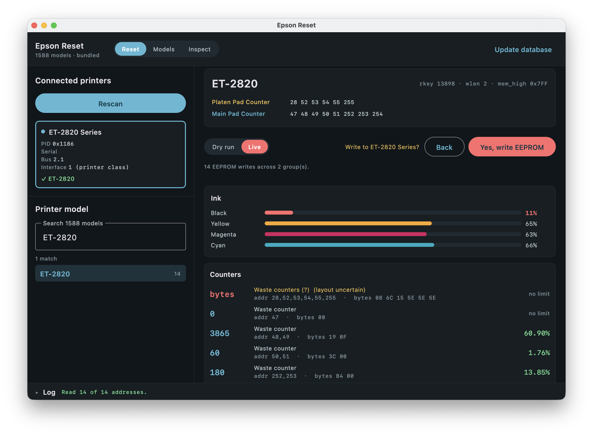

<h1> Epson Reset</h1>

[](https://github.com/yusnel-rojas/epson-reset/actions/workflows/build.yml)
[](#requirements)

A desktop app (macOS, Windows, Linux) for reading and resetting the waste ink pad counters on Epson printers.



- **Finds your printer** — on USB, or on the network over SNMP, which reports the exact model
- **Identifies it** — against a database of 1588 models, browsable in the app before you plug anything in
- **Reads the waste ink counters** — grouped addresses decoded into real values (`[48,49]` → `3865`)
- **Remembers their trend** — successful live reads build a local per-printer history and project a measured maximum
- **Resets them** — each write checked for the printer's `:42:OK;` acknowledgement
- **Backs up first** — the bytes a live run is about to overwrite are saved, and can be compared and restored
- **Dry run** — the whole sequence against a simulated EEPROM, touching no hardware. It's the default
- **Inspect** — read-only probing of a printer that isn't in the database, to work out its counter layout
- **Hex trace of every packet** — in the log panel, copied to the clipboard in one click for a bug report

## Before you use this

A waste ink counter is the printer's own record of how much ink its absorbent pad has soaked up.
Resetting that counter does not empty the pad. The ink is still in there, and a pad at the end of
its life still needs replacing — otherwise the ink eventually ends up somewhere you did not choose.

**Using this is entirely your decision and entirely your risk.** Whatever follows from it — an
overflowing pad, ink on the desk, a printer that stops working, a warranty the manufacturer
declines to honour — is yours to carry. The software comes with no warranty of any kind and no
promise that it does the right thing on your printer, and nobody who wrote it is accountable for
what happens to your hardware. Sections 15 and 16 of the [licence](LICENSE) say the same in legal
terms.

If that is not a trade you want to make, stay in dry run: it writes nothing.

## Running

```bash
./gradlew run
```

For UI development, start the app with Compose Hot Reload instead:

```bash
./gradlew hotRun --auto
```

Saving a Kotlin file recompiles and reloads the affected UI while keeping compatible state. Use the
hot-reload toolbar's reset/restart action after changes to startup, USB/network transports or other
long-lived resources.

Or build an installer for the machine you're on (dmg / exe / deb):

```bash
./gradlew packageDistributionForCurrentOS
```

Linux releases also include portable x86_64 and arm64 AppImages, which run without installation.

Everything the app does is in the window. The headless tools behind it — a self-check, the USB and
network probes, the restore tool — are in [Command line](docs/command-line.md).

## Requirements

Nothing, for a network printer — no driver, no library, no wrestling with the OS for the interface.
What a network printer will *let* you do varies; see [Network printers](docs/network-printers.md).

USB support differs by platform. On **Windows there is nothing to install and nothing to unbind** —
the app talks to the printer through the driver Windows already installed when you plugged it in, so
the printer stays a normal printer. On macOS and Linux USB needs libusb-1.0, and the OS print
subsystem has to let go of the printer first:

| | Library | Releasing the printer |
|---|---|---|
| Windows | none — uses the printer's own Windows driver | none — nothing to unbind, printing still works |
| macOS | `brew install libusb` | Remove it under System Settings → Printers & Scanners |
| Debian/Ubuntu | `sudo apt install libusb-1.0-0` | Automatic, or stop CUPS |

On macOS/Linux, without the library the app still runs — network printers, the database browser and
dry runs all work — but USB detection is off. Details and remedies:
[USB connections](docs/usb-connection.md) and [Troubleshooting](docs/troubleshooting.md).

## Safety

Dry run is the default on the reset path; switching to Live takes a second confirmation naming the
target printer. Reads carry no write key, so sampling counters is safe even against a mismatched
model — and the Inspect tab can't write at all.

A rejected write (`:42:NG;`) means the key doesn't match the model, and aborts the run rather than
hammering the EEPROM. Many models keep only the platen counter in EEPROM, so a reset leaves the
waste box counter alone and the box still needs servicing; the UI says so before you write. A
successful reset needs a power cycle to take effect.

Before the first write of any live run, the app saves the bytes that run is about to overwrite —
[Backup and recovery](docs/backup-and-restore.md).

Whether a reset can happen over the network is the printer's decision, not a setting — see
[the write gate](docs/network-printers.md#the-write-gate). Where a printer refuses, the app says
which refusal it was rather than failing obscurely.

The reset path has been run against a real printer: counters reset, read back at zero, and the
pre-reset snapshot restored to recover the original values. What that covers and what it does not —
network resets, the inspector's key discovery, percentages — is in
[Field notes](docs/field-notes.md#standing-limits).

## Documentation

[**docs/**](docs/README.md) — the technical detail behind all of the above.

| | |
|---|---|
| [Troubleshooting](docs/troubleshooting.md) | Where things usually stop, in order — starting with the printer the OS won't let go of |
| [Field notes](docs/field-notes.md) | What worked and what didn't against real hardware, including the wrong turn that damaged a printer |
| [Network printers](docs/network-printers.md) | SNMP identity, the command passthrough, the write gate, refusals, `netProbe` |
| [USB connections](docs/usb-connection.md) | libusb, claiming the interface, per-platform remedies |
| [Backup and recovery](docs/backup-and-restore.md) | Snapshots, comparison, restoring, where a restore may land |
| [Counter history](docs/counter-history.md) | The local live-read journal, fill rates, reset handling and projections |
| [Counter database](docs/counter-database.md) | The two data files, model capabilities, overlays, resyncing |
| [Measuring a maximum](docs/calibration.md) | Where a percentage comes from, and how to contribute one |
| [Printers not in the database](docs/inspect.md) | The read-only Inspect tab |
| [Preferences](docs/preferences.md) | `preferences.json`, window placement, history recording, the update check |
| [Command line](docs/command-line.md) | The headless tasks behind the window: `diagnose`, `restore`, the probes |
| [Architecture](docs/architecture.md) · [Implementation notes](docs/implementation-notes.md) · [Tests](docs/testing.md) · [Formatting](docs/formatting.md) · [Builds and releases](docs/releases.md) | Working on the app itself |

## Credits

**Protocol** — ported from [RxNaison/Epson-Waste-Reset](https://github.com/RxNaison/Epson-Waste-Reset)
(C++, [Apache-2.0](LICENSES/Apache-2.0.txt)). The packet framing, the key handling and the reset
sequence all come from there.

**Printer data** — from [reinkpy](https://codeberg.org/atufi/reinkpy) (AGPL-3.0), whose maintainers
have collected counter layouts and write keys for far more models than any one household could test.
A [scheduled workflow](.github/workflows/sync-printer-data.yml) re-fetches their `epson.toml` every
month, converts it into the two JSON files this app ships, runs the test suite and a dry run against
the result, and opens a pull request listing the models that moved — so the database keeps up with
theirs without anyone hand-editing it. See [Counter database](docs/counter-database.md).
