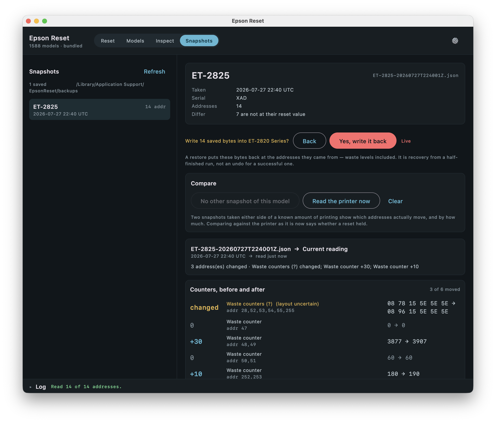

# Counter database

## Model capabilities

The **Models** tab lists the whole database against what the app can do with each entry. Every
column is derived from the bundled data at load time. Clicking a row selects that model.



| | |
|---|---|
| Resettable | 1475 of 1588 — the other 113 carry no EEPROM addresses |
| Platen-only | 313, where a reset clears the platen pad only |
| Values decoded | 123 fully, 1352 in part — upstream marks some layouts a guess, or the group is too wide to be one number |
| Percentage possible | 14 — a maximum is declared upstream for 6, measured here for the ET-282x family. [Your printer can add to that](calibration.md) |

Reset and read are separate columns even though the bundled data answers them identically today: an
OTA refresh or user overlay can move one without the other, and reading shouldn't inherit a "no"
from the write path. `CapabilityTest` pins every number above.

## One file per source, one file for the app

Two sources feed the database and they move at different speeds — a monthly bot, and hand edits
that must survive it. So each keeps its own files under `data/`, and nothing but its own pipeline
ever writes them:

| File | Gives | Written by |
|---|---|---|
| `data/reinkpy/database.json` | rkey / write keys / reset values in pad groups — drives the **reset** | `sync-printer-data.yml`, monthly |
| `data/reinkpy/counters.json` | which addresses group into one counter — drives the **read** | `sync-printer-data.yml`, monthly |
| `data/curated/calibrations.json` | how full each counter can get, measured here on real hardware — drives the **percentage** | by hand, never a machine |

The reinkpy pair differ because a pad group is not a counter. A group is everything the reset
writes to one pad, so `[48,49]` is two loose bytes to it, while reinkpy's grouping keeps it as one
2-byte little-endian value — the difference between showing `0x19 0x0F` and showing `3865`.

The app reads none of them. The `generatePrinterData` Gradle task splices them into a single
`printers.json` on every build, one section per source, each copied through verbatim. It is a splice
and not a merge on purpose: which maximum outranks which is a question about addresses, answered
once in `CounterSpecs` where it is tested, and not a second time in a build script.

Regenerate a source:

```bash
curl -sL https://codeberg.org/atufi/reinkpy/raw/branch/main/reinkpy/epson.toml -o epson.toml
python3 tools/convert_reinkpy.py epson.toml data/reinkpy/counters.json data/reinkpy/database.json
```

## Resyncing

**Sync printer data** in the Actions tab does the same on a runner, monthly or on demand. It runs
the tests and dry run against the result, then opens a PR listing which models were added, removed
or changed — always a PR, never a direct commit, since a group changing shape upstream changes what
the app reads together and what it writes. It writes only `data/reinkpy/`, so a resync never
discards the measured maxima in `calibrations.json`.

## Overlays

To add or correct a model without rebuilding, drop a `counters-overlay.json` next to the database
cache (`~/Library/Application Support/EpsonReset/` on macOS). A model in the overlay replaces the
bundled entry outright:

```json
{
  "groups": [
    {
      "models": ["ET-2825"],
      "counters": [
        { "addr": [48, 49], "desc": "Waste counter", "max": 8450 },
        { "addr": [50, 51], "desc": "Waste counter (platen)" }
      ]
    }
  ]
}
```

Add a `max` and that counter starts showing a percentage. Where that number comes from is
[Measuring a maximum](calibration.md).
